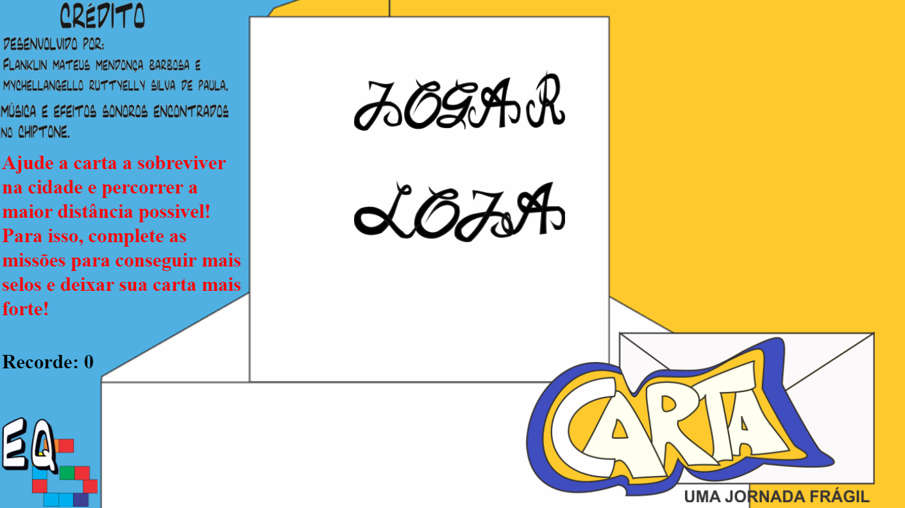

---  
layout: default
---  
* * *
# **Quem sou eu** ?  

 **Meu nome é**  
 * * *  
 Franklin Mateus Mendonça Barbosa  

 **O que eu faço**  
 * * *  
 Desenvolvo jogos digitais. Minhas principais experiências são com programação, level design e game design.  
  
# **Produções**  
1. Explore  
< dt>Um jogo de aventura qm que você deve explorar o Brasil e aprender sobre a cultura das 5 regiões do nosso país.  </ dt >
 1 . Carta: uma jornada frágil  
< dt > Um jogo de corrida infinita em que você controla uma carta indevesa em meio ao caos da cidade. Por quanto tempo você conse mante-la a salvo do caos do dia a dia? </ dt >  
  
## **Games**  
1. [Explore](https://thewordkh.github.io/Explore/)    
2. [Carta: uma jornada frágil](https://mychellangello.github.io/Carta%20uma%20jornada%20fr%C3%A1gil/)  
3. [The Darkness Ascension](https://guiegle.github.io/tda2/)    
### **Apresentações**  

# Cabou

